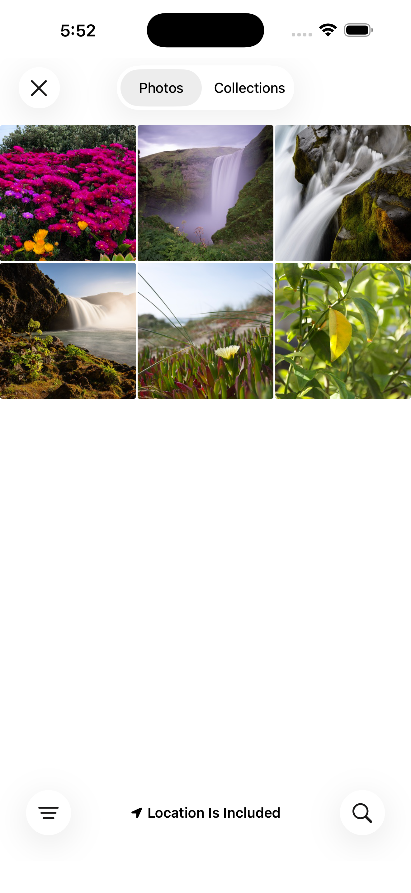
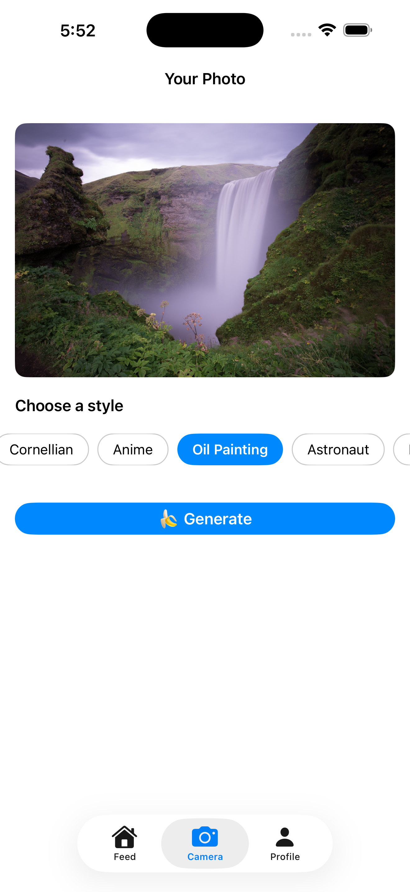
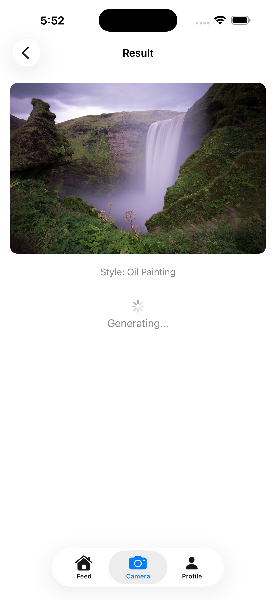
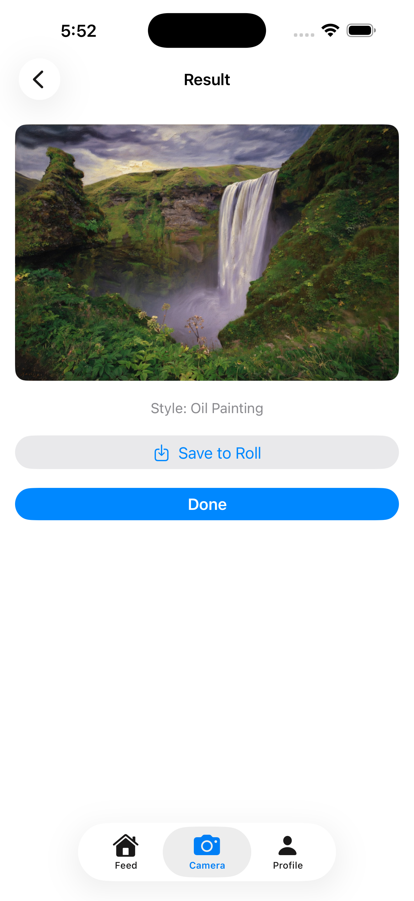
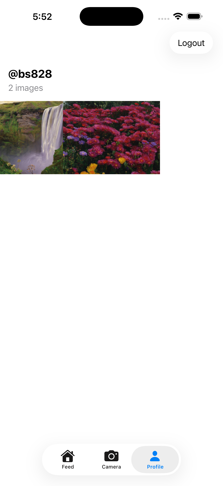

<div align="center">

# Nano Banana

**AI photo style transfer for iOS.**

Snap a photo, pick a style, and watch xAI's `grok-imagine-image` model re-imagine it.
Keep posts private or share them to the public feed.

</div>

---

## User flow

<table>
  <tr>
    <td align="center" width="33%">
      <br />
      <strong>1. Pick a photo</strong><br />
      <sub>From your library or live camera</sub>
    </td>
    <td align="center" width="33%">
      <br />
      <strong>2. Choose a style</strong><br />
      <sub>Cornellian · Anime · Oil Painting · Astronaut · Politician · Noir</sub>
    </td>
    <td align="center" width="33%">
      <br />
      <strong>3. xAI generates</strong><br />
      <sub>~5 seconds end to end</sub>
    </td>
  </tr>
  <tr>
    <td align="center" width="33%">
      <br />
      <strong>4. See the result</strong><br />
      <sub>Save to camera roll, or done</sub>
    </td>
    <td align="center" width="33%">
      <br />
      <strong>5. Manage your profile</strong><br />
      <sub>Every generation, public and private</sub>
    </td>
    <td align="center" width="33%">
      <br />
      <strong>6. Browse the feed</strong><br />
      <sub>For You · Following · Trending · Recent</sub>
    </td>
  </tr>
</table>

---

## Tech stack

| Layer | Tools |
|---|---|
| iOS | SwiftUI · URLSession · UIImagePickerController |
| Backend | Node.js · Express 5 · PostgreSQL · dotenv |
| AI | xAI `grok-imagine-image` via `/v1/images/edits` |
| Local infra | Docker (Postgres) |

---

## Quick start

```bash
cd hack-challenge
npm install
cp .env.example .env   # fill in DATABASE_URL and XAI_API_KEY

# Postgres in Docker
docker run -d --name nb-pg \
  -e POSTGRES_PASSWORD=dev \
  -e POSTGRES_DB=nanobanana \
  -p 5432:5432 postgres:16

# Apply schema once Postgres is healthy
docker exec -i nb-pg psql -U postgres -d nanobanana < db/schema.sql

# Start the server (PORT=3001 by default)
node server.js
```

Then open `hack-challenge.xcodeproj` in Xcode and build. Confirm `APIService.baseURL` matches the backend port (`http://localhost:3001`).

---

## API

| Method | Path | Description |
|---|---|---|
| `GET` | `/feed?page=&limit=` | Paginated public images joined with username |
| `GET` | `/users/:username` | Find or create a user |
| `GET` | `/users/:user_id/images?viewer_id=` | A user's images. Owner sees public + private; others see public only |
| `POST` | `/generate` | `{ user_id, prompt, image_base64, mime_type, is_public }` → xAI image edit |
| `DELETE` | `/images/:id` | Body `{ user_id }`. Owner only |

---

## Frontend description — Ben Shvartsman

- **Three-tab SwiftUI app** (Feed / Camera / Profile) with a custom bottom tab bar
- **Feed**: Pinterest-style masonry grid with For You / Following / Trending / Recent filter tabs; auto-refreshes after a new generation completes
- **Camera flow**: native iOS photo picker → Generate screen with six horizontally-scrolling style chips (Cornellian · Anime · Oil Painting · Astronaut · Politician · Noir) → in-flight loading state → Result screen with Save to Roll and Done
- **Profile**: `@username` header, image count, masonry grid of all the user's images (public + private), and Logout
- **Auth**: bottom-sheet username login (find-or-create, no password), session persisted in `UserDefaults` across launches; auth-gated on Camera and Profile tabs, Feed is open
- **Networking**: `URLSession` async/await against the Express backend at `localhost:3001`; `JSONDecoder` with snake_case → camelCase; base64-encoded JPEG upload for `POST /generate`; `AsyncImage` loads xAI-hosted result URLs ([imgen.x.ai](https://imgen.x.ai)); save-to-roll via `UIImageWriteToSavedPhotosAlbum`
